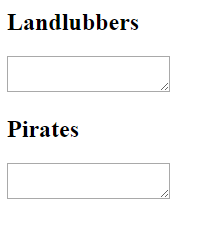
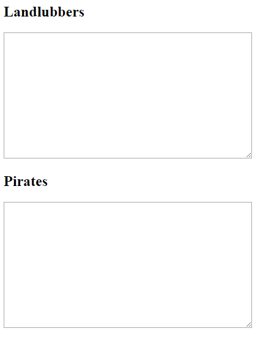
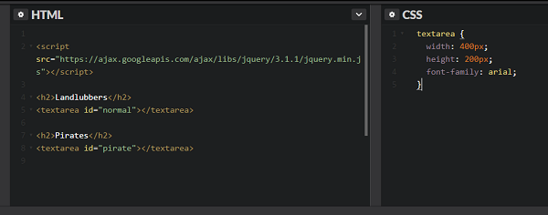

## Typing in your text

- You need to add two `<textarea>` boxes. In one of them you will type in the normal text, while the other displays the pirate speak text. These boxes should appear on the page, so this code goes between the `<body>` and `</body>` tags (or in the HTML box if you are using CodePen).

  This code creates a box called "Landlubbers", which is where we will write our normal text. Notice that it has the **id** value `normal`: we are giving the text box a name so we can refer to it later.

  ```html
  <h2>Landlubbers</h2>
  <textarea id="normal"></textarea>
  ```

- Using this code as an example, add another `<textarea>` box below the first one which will contain the pirate speak text. Set the id to `pirate`.

- Save the file and refresh your internet browser to check that the textarea boxes appear as expected.

  

- If you want the textarea boxes to be a bit bigger or to use a different font, you can add CSS code in the `<head>` (or in the CSS section on CodePen) to change the style of the `<textarea>` boxes.

  ```html
  <style type="text/css">
    textarea {
      width: 400px;
      height: 200px;
      font-family: arial;
    }
  </style>
  ```

  

- Your code so far should look like this if you are using a text editor:

  ```html
  <html>
  <head>
  <style type="text/css">
    textarea {
      width: 400px;
      height: 200px;
      font-family: arial;
    }
  </style>

  <script src="https://ajax.googleapis.com/ajax/libs/jquery/3.1.1/jquery.min.js"></script>

  </head>
  <body>

  <h2>Landlubbers</h2>
  <textarea id="normal"></textarea>

  <h2>Pirates</h2>
  <textarea id="pirate"></textarea>

  </body>
  </html>
  ```

  ...or like this if you are using CodePen:

  

