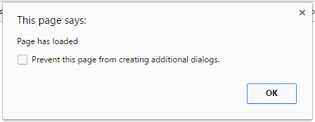

## Checking the page has loaded

jQuery allows you to detect when **events** happen on a web page (such as the user typing or clicking on something) and then update the page live in response to the event. We need to check that the page has fully loaded before we start detecting events.

- If you are using a text editor, add a `<script>` tag and a closing `</script>` tag immediately after the line of code where you imported jQuery. If you are using CodePen, skip this step but **write all of the rest of the code in the JS section of your pen**.

- Between the `<script>` tags (or in the **JS** section on CodePen), add the following code:

  ```JavaScript
  $(document).ready(function(){
    alert("Page has loaded");
  });
  ```
  
  In plain English, this code says "Wait until the page has fully loaded, then make a box pop up saying that it has loaded".

  The code may look complicated, so let's break it down:
  
  - `$(document)` - This identifies what you are talking about, in this case the whole document. This is the **identifier**.
  - `.ready(` - This is a call to a function which means "when it is ready", or "when it has fully loaded". This is the **event**.
  - `function(){` - This creates a function (a section of code) to be executed when the event is triggered.
  - `alert("Page has loaded");` - This makes a box pop up with the message "Page has loaded". This is the **action**.
  - `});` - The ending for the function (`}`), the ending for the `.ready(` call (`)`) and the end of this line of code (`;`).

  We can generalise this as "Wait until [**identifier**] has [**event**] and do [**action**]".

  If you are used to indentation in Python, you might have noticed that indentation is not essential in Javascript. It is still advisable to indent your program properly, though: indentation ensures your code is readable both for you, and for anyone who may be helping you to create the resource! 

- Save the code and refresh your web browser. If your jQuery code has worked, you should see a pop-up box appear when you load the page.

  

