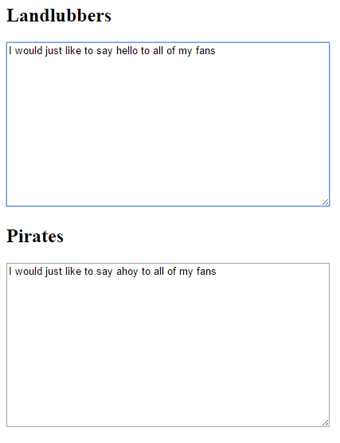

## Replace words with pirate words

- To talk like a pirate, we need to replace certain words with their piratical equivalent. For example, we know pirates say "ahoy" instead of "hello". Luckily, we know the text that was typed in the Landlubbers text box because we have retrieved and stored it in our `words` variable. Let's use a function to find the word `"hello"` and replace it with `"ahoy"`.

- Here is a line of code which should be copied and pasted where the gap is left in the previous code, between `var words = $("#normal").val();` and `$("#pirate").val(words);`:

  ```JavaScript
  words = words.replace(/hello/gi, "ahoy");
  ```

  Let's examine this code further:
  
  - `words =` - Set the value of the variable `words` equal to...
  - `words.replace(` - ...whatever it was before, but replace...
  - `/hello/gi` - ...the word "hello" with...
  - `, "ahoy");` - ...the word "ahoy"

  You might be wondering why the word "hello" is written as `/hello/gi`: this pirate secret will be revealed in the next section!

- Save your code and test it by typing in a sentence containing the word "hello" in the Landlubbers box. You should see your word replaced with "ahoy" in the Pirates box.

  

- Now see if you can add more lines of code like this to replace other words with more piratical versions. For example, pirates say "yer" instead of "you", and "avast" instead of "stop". Try looking for pirate speak websites to find out other pirate word substitutions to experiment with! Use the same code, but put in the word you want to find, and the pirate equivalent you want to replace it with.

